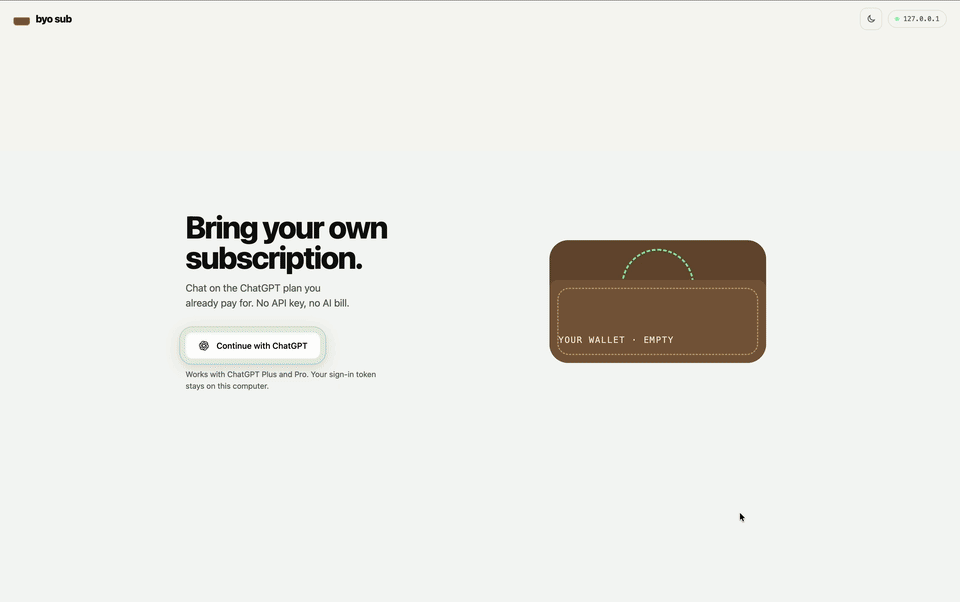

# byo sub

**Let people use their own ChatGPT plan in your app, no API key, no AI bill.**

byo sub ("bring your own subscription") is a small open-source starter app. It runs on your computer, you sign in with ChatGPT, and you chat with an AI agent using the ChatGPT Plus or Pro plan you already pay for. Clone it, read it in one sitting, and turn it into your own thing.

<!-- Demo GIF goes here:  -->
> _Demo GIF coming soon._

## What you need

- [Node.js](https://nodejs.org) 20 or newer
- A ChatGPT **Plus** or **Pro** account, to test with

## Quickstart

```bash
git clone https://github.com/WaviestSun/byo-sub.git
cd byo-sub
npm install
npm start
```

It opens in your browser by itself (usually at **http://127.0.0.1:1455**; the address is printed too). Click **Continue with ChatGPT**, approve on chatgpt.com, tap the coin, and start chatting. To skip opening the browser, start it with `BYO_SUB_NO_OPEN=1 npm start`.

### Not a coder? Let Claude set it up

Open [Claude Code](https://claude.com/claude-code) (in your terminal or the Claude desktop app), paste this in, and follow along:

```text
Please set up and start the "byo sub" app for me. I'm not a developer, so explain anything I need to do in simple steps.

1. Check that Node.js 20 or newer is installed. If it isn't, tell me exactly how to install it (the installer from nodejs.org is fine) and wait for me.
2. Download the app from https://github.com/WaviestSun/byo-sub into a folder called byo-sub in my home folder.
3. Before running anything, read the code and tell me in two or three plain sentences whether it sends my ChatGPT sign-in anywhere other than OpenAI.
4. Run npm install, then npm start, and leave it running. It should open in my browser by itself.
5. If it doesn't, give me the link it prints (it starts with http://127.0.0.1) and tell me to open it in Chrome or Safari.

Don't change any of the app's files, and don't open anything in ~/.config/byo-sub (that's where my sign-in is saved).
```

When the app opens in your browser, click **Continue with ChatGPT**. To stop the app later, ask Claude to stop it, or close the terminal.

## How it works

Five files do the real work:

| File | What it does |
| --- | --- |
| `server.js` | Starts the app on `127.0.0.1` (only your computer can reach it) and routes each request. |
| `src/auth.js` | The "Continue with ChatGPT" flow: builds the sign-in link, checks what comes back, and verifies who you are. |
| `src/tokens.js` | Saves your sign-in to a private file on your computer and quietly renews it every hour. |
| `src/chat.js` | Sends your chat to OpenAI with your sign-in and streams the reply back, a few words at a time. |
| `src/chats.js` | Saves each conversation as a file on your computer, so you can reopen it and the agent remembers it. |

Everything you see lives in `public/`: the page, its styles, the coin animation (`effects.js`), the chat styles (`vibes/`) and the watercolour painter (`paint.js`).

**The flow:**

1. You open the app.
2. You click **Continue with ChatGPT**.
3. On chatgpt.com you sign in and allow byo sub to use your plan.
4. You land back in the app, your plan drops into your wallet, and you're connected.
5. You chat. Each message is sent from your computer to OpenAI using your plan.

Your sign-in and your chats are saved in `~/.config/byo-sub/`, readable only by your user account. **Sign out** deletes the sign-in and tells OpenAI to end the session. Your chats stay until you delete them from the sidebar (or delete the `chats` folder).

## The rules, in plain English

These come from OpenAI's [Sign in with ChatGPT terms](https://openai.com/policies/sign-in-with-chatgpt-terms/) and docs.

- **Open source and running on the user's own computer?** You can use ChatGPT plan usage today, like this app does.
- **A hosted website or a paid app?** You need OpenAI's approval first. [Apply here](https://openai.com/form/sign-in-with-chatgpt-interest/).
- **Only Plus and Pro users** can use their plan this way.
- **You can't charge people** for what their plan already covers. Their plan has to work in your app without paying you or upgrading.
- **Their token stays on their machine.** Don't send it to a server, don't log it, and don't share, pool or resell plan usage.
- **Use your own app's name**, not "ChatGPT" or "GPT", and keep OpenAI's button and logo exactly as they are.

## Make it your own

- **Name:** change `APP_NAME` in `src/auth.js`. It's shown on OpenAI's approval screen.
- **Personality:** change `SYSTEM_PROMPT` in `src/chat.js`.
- **Model:** the picker lists the models your account offers, and the first one is the default. Nothing is hard-coded.
- **Colours:** edit the two colour blocks at the top of `public/styles.css`.
- **Chat styles:** use the arrows at the sides of the chat to switch between Classic, Receipt, Terminal, Comic and Painted. To add your own, copy a file in `public/vibes/`, add a `<link>` for it in `public/index.html`, and add it to the list in `public/vibes.js`.

## Limitations (OpenAI preview)

Plan usage is in preview, so some things work differently from the normal OpenAI API:

- Every request must be streamed and not stored (`stream: true`, `store: false`), so the app sends the whole conversation each time.
- The system prompt goes in `instructions`. Settings like temperature or max output tokens aren't supported.
- No image generation, file search, Code Interpreter, computer use, hosted MCP/connectors or tool search. Web search depends on the model and account.
- No audio or video input.
- Plus has a five-hour usage limit shared across every app using the plan. Pro doesn't have that limit.
- There's no way to see how much of your plan is left, so the app shows tokens used in this chat and links to **Manage usage** on chatgpt.com.

## Next steps

Ideas this starter leaves out on purpose:

- **API key fallback** for people without Plus or Pro.
- **Multiple accounts**, with an account picker.
- **Tools**, so the agent can do things: web search, or local tools like reading notes.
- **Memory across chats**, so the agent remembers things about you from one chat to the next.

## Safety note

This app stores a sign-in token on your computer that can use your ChatGPT plan, plus your chats. That's how it works, and it's why the token never leaves your machine. Still, read the code before you run any repo like this one, including this one. If you ever think a token leaked, disconnect the app in [ChatGPT settings](https://chatgpt.com/settings/usage).

## Docs

- [Sign in with ChatGPT: quickstart](https://developers.openai.com/siwc/quickstart)
- [ChatGPT plan usage in open-source apps](https://developers.openai.com/siwc/token-sharing-open-source)
- [Sign in](https://developers.openai.com/siwc/token-sharing-open-source/sign-in) · [Accounts and sessions](https://developers.openai.com/siwc/token-sharing-open-source/profiles-and-sessions) · [Models and inference](https://developers.openai.com/siwc/token-sharing-open-source/models-and-inference)
- [Errors and recovery](https://developers.openai.com/siwc/token-sharing-open-source/errors-and-recovery) · [Preview limitations](https://developers.openai.com/siwc/token-sharing-open-source/preview-limitations)
- [UI/UX guidelines](https://developers.openai.com/siwc/ui-ux-guidelines)
- [Cookbook: Sign in with ChatGPT](https://developers.openai.com/cookbook/articles/sign-in-with-chatgpt)
- [Sign in with ChatGPT terms](https://openai.com/policies/sign-in-with-chatgpt-terms/)

## Credits and licences

- Code: [MIT](LICENSE).
- The ChatGPT logo (`public/chatgpt-mark*.svg`) is an OpenAI trademark, used as OpenAI's sign-in guidelines describe. It isn't covered by the MIT licence. See the [OpenAI brand guidelines](https://openai.com/brand/).
- Fonts in `public/fonts/` (Bangers, Caveat, Comic Neue, IBM Plex Mono, VT323) are under the SIL Open Font License. Their licence files sit next to them.

byo sub isn't made by, affiliated with, or endorsed by OpenAI.
